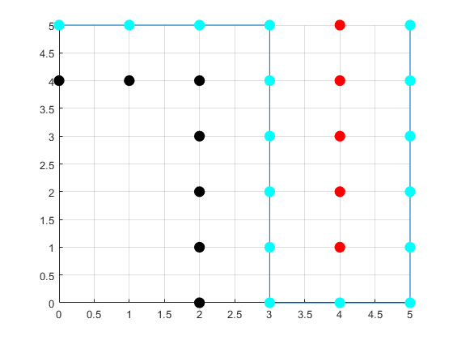

# Path Planning Algorithms For Autonomous Mobile Robots

This repository contains path planning algorithms for autonomous mobile robots.

The concepts of graph theory and graph based search techniques are implemented as MATLAB programs for planning optimal path from the source node to the goal node.

User defines the localization map compraising of obstacles and navigable free-space (such as an occupancy grid map) as matrix input and also defines the source and goal nodes. The search techniques traverse this map in order to determine optimal path from the source node to the goal node.
